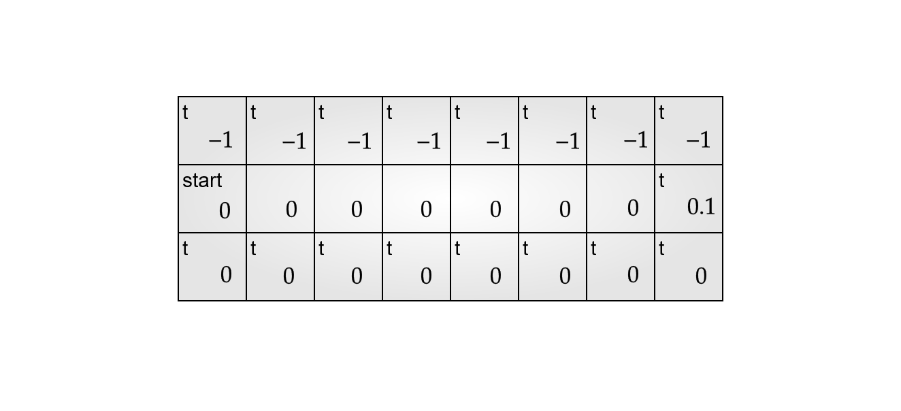
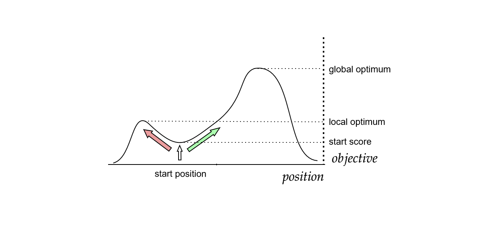
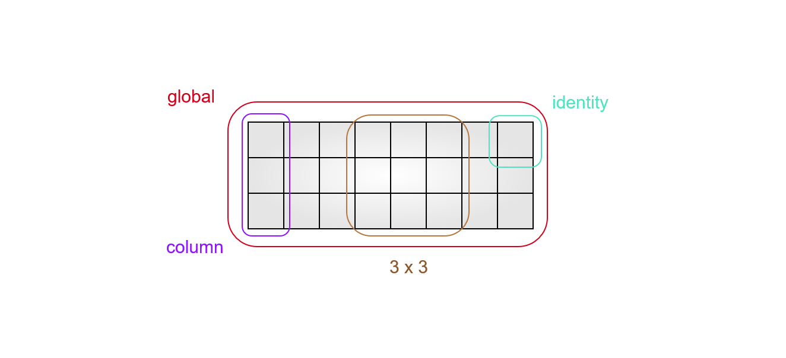
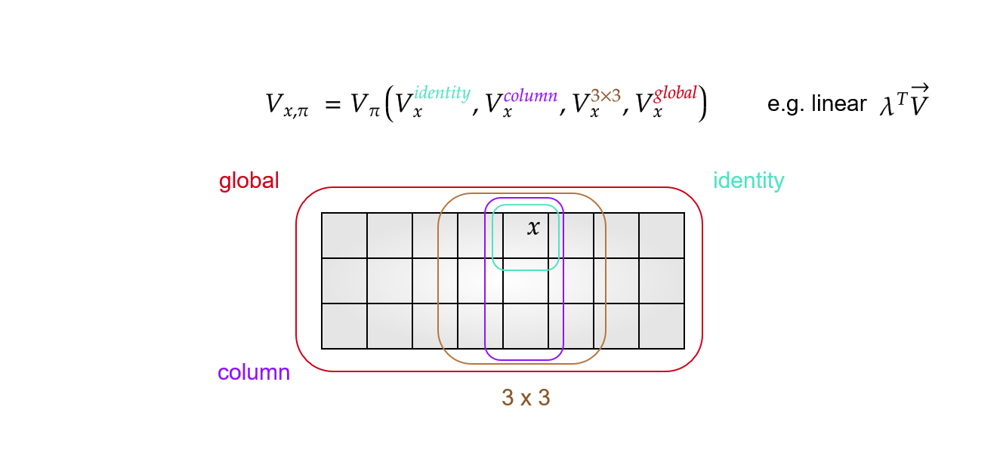
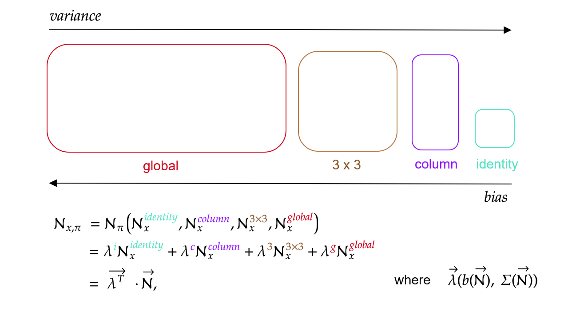

<!--
# Abstract
Deep reinforcement learning is great with abundant resources and many samples. Reality however confronts agents with limited resources, sparse rewards and deceptive feedback. We need rapid agents that explore effectively, by finding sparse rewards, and efficiently, by using few samples. Recent work has shown that novelty as a proxy for "interestingness" can be used to guide exploration in an effective manner. Novelty search biases exploration towards behaviors that are potentially interesting. Additionally, abstraction techniques can help make efficient use of samples. Abstraction is successful when it constrains an agent to focus on features that are most influential by abstracting out irrelevant information. Our contribution towards effective and efficient deep exploration is novelty guided exploration with abstraction.
-->
<!-- -->

# Outline

1. Our Ambition: Rapid Reinforcement Learning
2. Why Deep Exploration is Hard
    - Sparsity
    - Deception
    - Bounded Resources
3. Approaches
    - Abstraction
    - Novelty & Variants
4. Contributions
    - Abstraction over Novelty
    - Combination of Abstractions
5. Discussion

# Our Ambition: Rapid Reinforcement Learning

## Our ambitions
1. Solve this in three trajectories,
2. Explore with emergent policies of gradually increasing complexity, and finally
3. Sample efficient discovery of sparse rewards.

# Deep Exploration

Finding rewards that are:

 1. Sparse

 2. Deceptive

with Bounded Resources.

## The Problem(s) with Objectives

Lehman, Stanley (2011)

# Deep Exploration - Sparsity

{ width=75% }

# Deep Exploration - Deception

> Sometimes a mutation increases fitness but actually leads further from the objective. (Goldberg, 1987)

# Deep Exploration - Bounded Resources

> We can not practically rely on convergence in the limit.

# Approach - Abstraction

<!-- Contexts over transition histories are also possible. -->

# Approach - Abstraction

An Abstractor $\mathcal{A}: (C, f, V, N)$

$C$ set of contexts;

$f: \mathcal{H} \times \mathcal{A} \xrightarrow{} C$, function mapping histories to contexts;

$V: \mathcal{C} \times \mathcal{A} \xrightarrow{} \mathbb{R}$, function mapping action values in context;

$N: \mathcal{C} \times \mathcal{A} \xrightarrow{} \mathbb{N}$, function counting samples used to estimate the abstraction value, a proxy for uncertainty.

Baier, Kaisers (2021)

# Approach - Multi Level Abstractions

$V^C(c, a) = V^C(f(x, a))$, for all C in $\{identity, column, 3\times 3, global\}$

# Approach - Auxiliary-Objective Search

DO NOT: pursue reward maximizing behavior

DO: pursue 'novel' behavior

via intrinsic rewards

# Approach - Intrinsic Rewards

# Approach - Auxiliary-Objective Search

> Criticism: internal reward just another objective

> Rebuttal: novelty rewards are based on past behaviors and mostly orthogonal to external rewards

Lehman, Stanley (2011)

Best when always changing, non-stationary, diverging.

# Approach - Count Based Exploration

SUBJECT: $\{f_i\}_{i \in M, t}:$ features

MEASURE: $\rho_t = \sum_{i \in M} P(f_i)$

Count occurrences of features and construct a density model for the learned features in an environment.

Martin et. al. (2017)

# Approach - Novelty

> New is not always Interesting, but Interesting is always New.  

SUBJECT: $x:$ behavior

MEASURE: $\rho(x) = \frac{1}{k} \sum_{i=0}^k dist(x,\mu_i)$

The average distance of a behavior to its k-nearest behaviors.

Lehman, Stanley (2011)

Video: [Novelty-Biped](https://www.youtube.com/watch?v=dXQPL9GooyI&t=120s)

# Approach - Diversity Driven RL

SUBJECT: $\pi:$ policy

MEASURE: $L_D = L - E_{\pi'\in\Pi} [\alpha D(\pi, \pi')]$

The difference of a policy to other policies stored in memory.

$D$ could be KL divergence, MSE, L2-norm ...

Hong et. al. (2018)

# Approach - Curiosity

SUBJECT: $\pi:$ policy

MEASURE: $||\pi(x_t, a_t) - \varpi(x_{t+1})||_2^2$

Mean squared error against a fixed variance gaussian density.

Burda et. al. (2018)

# Approach - Approximating Novelty

When behavior space is intractable, continuous, multidimensional: LARGE

SUBJECT: $x:$ behavior passed through an auto-encoder

MEASURE: $\rho(x) = \frac{1}{k} \sum_{i=0}^k dist(x,\mu_i)$

Ramamurthy et. al. (2020)

# Approach - Curiosity Bottleneck

> Noisy-TV Problem: Pure randomness is always novel, and truly un-interesting

SUBJECT: $p_{\theta}(Z|X):$ compressor model

FIND: $\min_{\theta} -I(Z;Y) + \beta I(X;Z)$

MEASURE: $\rho(x) = KL [p_{\theta}(Z|x) || q(Z)]$

Kim et. al. (2019)

# Contributions - Abstraction over Novelty

# Contributions - Combining Abstractions

# Discussion

1. How else can we combine Abstractions?
2. Can we deal with a changing environment?
3. How does this fit in with Open Ended Learning?
